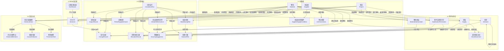

# 本体分层拓扑（xgimi-rebuild）

> 分层混合图：subgraph=业务层（实体 layer 字段），连线标签=关系语义名，方向 1 侧 → n 侧。

```mermaid
    flowchart TD
    subgraph SG_16052324["L1 主数据"]
        Project["项目<br/>Project"]
        Material["物料<br/>Material"]
        Supplier["供应商<br/>Supplier"]
        SupplierSupplyCondition["供应商供货条件<br/>SupplierSupplyCondition"]
        UnitConversion["单位换算<br/>UnitConversion"]
    end
    subgraph SG_83135377["L2 BOM与变更"]
        BomLine["BOM 行<br/>BomLine"]
        EcnRecord["工程变更记录<br/>EcnRecord"]
    end
    subgraph SG_17037725["L3 需求与供给"]
        Demand["需求<br/>Demand"]
        MaterialAuthorization["物料授权<br/>MaterialAuthorization"]
        Supply["供给<br/>Supply"]
        StockMovement["库存收发流水<br/>StockMovement"]
        SubstitutionPermission["替代与转用许可<br/>SubstitutionPermission"]
    end
    subgraph SG_66464275["L4 计算输出"]
        CalculationRun["计算运行<br/>CalculationRun"]
        ChangeRecord["变化记录<br/>ChangeRecord"]
        ImpactRecord["影响记录<br/>ImpactRecord"]
        AllocationRecord["供需分配记录<br/>AllocationRecord"]
        SourcingSuggestion["策备建议<br/>SourcingSuggestion"]
        VendorReferenceList["供应商参考清单<br/>VendorReferenceList"]
        PeriodSupplyDemand["分期供需<br/>PeriodSupplyDemand"]
        SlowMovingRisk["呆滞风险<br/>SlowMovingRisk"]
        SolutionPlan["处理方案<br/>SolutionPlan"]
    end
    subgraph SG_6644107["L5 历史分析"]
        HistoricalCase["历史呆滞案例<br/>HistoricalCase"]
        HistoricalMilestone["历史关键时点<br/>HistoricalMilestone"]
        CauseAttribution["原因归因<br/>CauseAttribution"]
        PreventionRule["预防规则<br/>PreventionRule"]
    end
    Material -->|父项物料| BomLine
    Material -->|子项物料| BomLine
    Project -->|隶属项目| BomLine
    EcnRecord -->|产生于变更| BomLine
    Project -->|归属项目| Demand
    Demand -->|被需求覆盖| Demand
    Demand -->|替换历史版本| Demand
    Project -->|授权项目| MaterialAuthorization
    Material -->|授权物料| MaterialAuthorization
    Material -->|供给物料| Supply
    CalculationRun -->|所属运行| Supply
    Material -->|收发物料| StockMovement
    Supply -->|来源供给| StockMovement
    Supplier -->|供货供应商| SupplierSupplyCondition
    Material -->|适用物料| SupplierSupplyCondition
    Material -->|被替代物料| SubstitutionPermission
    Material -->|替代物料| SubstitutionPermission
    Project -->|适用项目| SubstitutionPermission
    Material -->|换算物料| UnitConversion
    CalculationRun -->|所属运行| ChangeRecord
    BomLine -->|涉及BOM行| ChangeRecord
    SubstitutionPermission -->|涉及替代关系| ChangeRecord
    MaterialAuthorization -->|涉及授权| ChangeRecord
    CalculationRun -->|所属运行| ImpactRecord
    Project -->|受影响项目| ImpactRecord
    Material -->|受影响物料| ImpactRecord
    Demand -->|分配需求| AllocationRecord
    Supply -->|分配供给| AllocationRecord
    SubstitutionPermission -->|依据替代许可| AllocationRecord
    CalculationRun -->|所属运行| AllocationRecord
    Material -->|建议物料| SourcingSuggestion
    Supplier -->|建议供应商| SourcingSuggestion
    VendorReferenceList -->|列入参考清单| SourcingSuggestion
    CalculationRun -->|所属运行| SourcingSuggestion
    Supplier -->|面向供应商| VendorReferenceList
    CalculationRun -->|所属运行| VendorReferenceList
    Material -->|供需物料| PeriodSupplyDemand
    CalculationRun -->|所属运行| PeriodSupplyDemand
    Material -->|风险物料| SlowMovingRisk
    CalculationRun -->|所属运行| SlowMovingRisk
    SlowMovingRisk -->|处置风险| SolutionPlan
    Supply -->|调整供给| SolutionPlan
    CalculationRun -->|所属运行| SolutionPlan
    Project -->|历史项目| HistoricalCase
    Material -->|案例旧料| HistoricalCase
    Material -->|案例新料| HistoricalCase
    HistoricalCase -->|归属案例| HistoricalMilestone
    HistoricalCase -->|归属案例| CauseAttribution
    HistoricalCase -->|源自案例| PreventionRule
```
